# gitbash 2.0

## 1. 简介

git脚本

| 脚本名                    | 别名   | 功能                |
|------------------------|------|-------------------|
| task_manage.sh         | task | 任务管理，管理工作空间，项目，分支 |
| batch_get_remote.sh    | bgr  | 批量获取远程url脚本       |
| batch_set_remote.sh    | bsr  | 批量设置远程url脚本       |
| new_workspace          | nwo  | 新建工作空间            |
| batch_new_branch.sh    | nb   | 批量创建分支脚本          |
| cb.sh                  | cb   | 批量切换分支脚本          |
| mg.sh                  | mg   | 一键合并分支脚本          |
| batch_pull             | gpl  | 批量拉取远程代码          |
| batch_delete_branch.sh | db   | 批量删除分支脚本          |
| batch_del.sh           | bd   | 批量删除脚本            |

大部分命令直接输入或添加-h参数会显示帮助文档，尚未添加帮助文档的后续会继续补充，示例如下


## 2. 环境配置

### 2.1 Windows git配置

#### 2.1.1 安装windows版本的git(操作步骤参考：https://zhuanlan.zhihu.com/p/123195804)

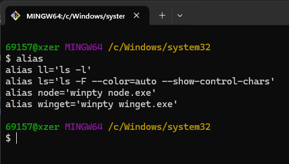

#### 2.1.2 下载gitbash脚本到本地C:\github\gitbash目录下

#### 2.1.3 打开git安装目录(根据个人情况区分，我这里是，C:\Program Files\Git\etc\profile.d\)，在aliases.sh文件最后添加如下代码

```bash
if [ -f /c/github/gitbash/.bash_profile ]; then
  . /c/github/gitbash/.bash_profile
fi
```

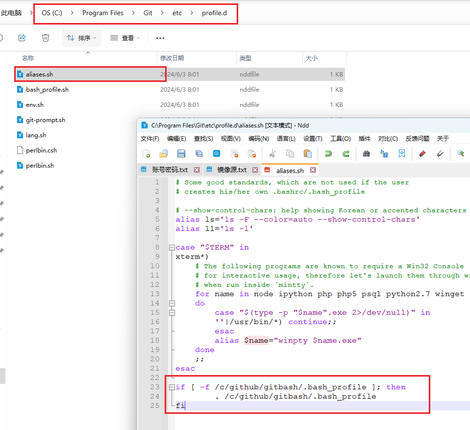

#### 2.1.4 修改保存后，重新打开git，可以看到别名已经生效

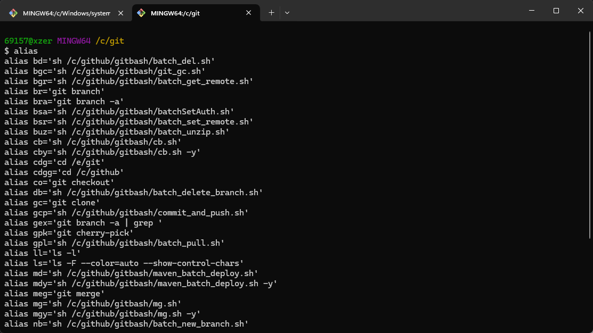

### 2.2 脚本config配置

#### 2.2.1 复制config_demo文件夹，并命名为config文件夹

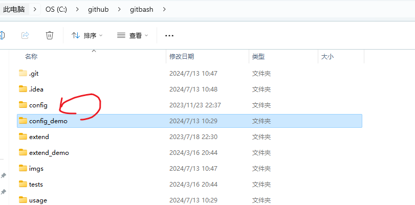

#### 2.2.2 项目地址配置（remote.txt）

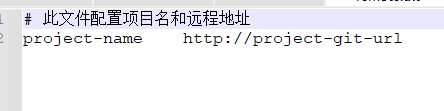

##### 2.2.2.1 本地已有项目，快速生成remote.txt

> 打开本地项目目录，执行 `bgr` 命令，没有远程url的项目不会生成（可通过git remote -v命令查看是否远程项目）

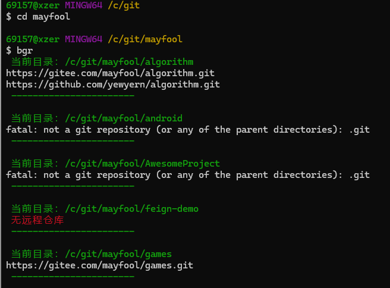

> 生成的remote.txt在当前目录下，查看并移动到gitbash/config/remote.txt文件

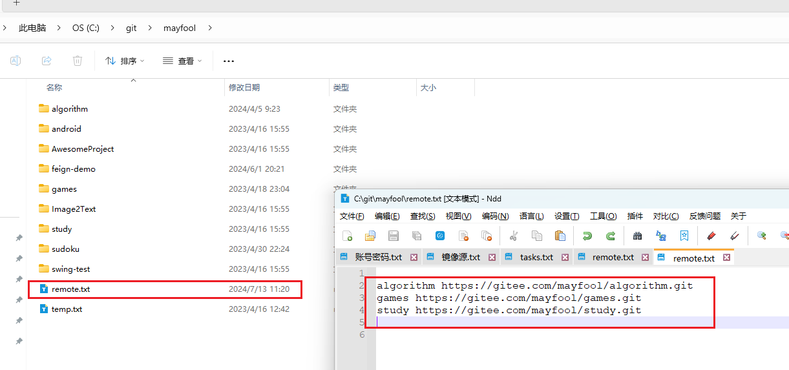

#### 2.2.3 集中式环境分支配置（branch_${环境名}.txt，示例：branch_dev.txt）

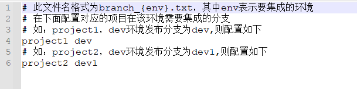

## 3. 常用脚本使用

### 3.1 添加任务

#### 3.1.1 任务文件说明

1. 文件路径：gitbash/config/task.txt
2. 字段说明:

| 字段名             | 描述         | 备注                                                           |
|-----------------|------------|--------------------------------------------------------------|
| id              | 任务id       | 必填项，自动递增生成，倒序排列                                              |
| task_name       | 任务名        | 必填项                                                          |
| work_dir        | 工作空间路径     | 必填项                                                          |
| task_branch     | 任务分支       | 必填项                                                          |
| projects        | 项目列表       | 必填项                                                          |
| ${env}_branch   | 指定环境分支     | 额外扩展列                                                        |
| br_file_env_pre | 环境分支配置文件前缀 | 额外扩展列，例如：此项配置为 branch_my ，则查找dev环境的分支会从 branch_my_dev.txt中查找 |
| remote_file     | 远程文件配置     | 额外扩展列                                                        |
| deleted_flag    | 删除标识       | 必须放在在最后，不需要展示列名                                              |

#### 3.1.2 任务添加操作

> 1.直接修改文件内容

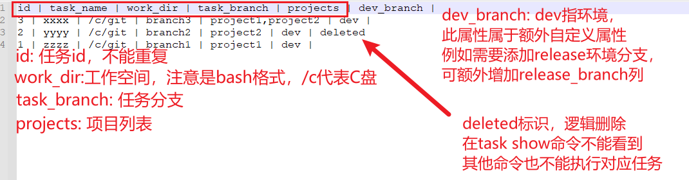

```bash
# 命令添加模式1
task add
```

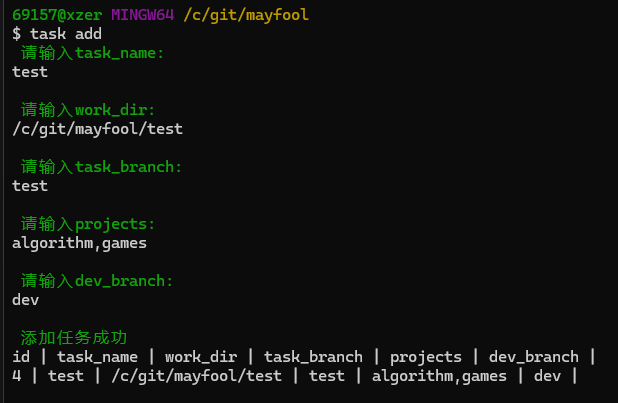

```bash
# 命令添加模式2，指定模板为任务4
task add -t 4
```

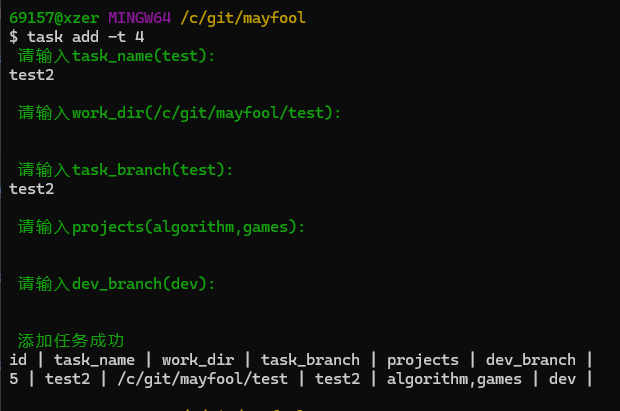

### 3.2 根据任务创建工作空间

```bash
# 创建任务id 4 对应的工作空间
# 1、自动拉取远程项目
# 2、根据master分支创建并切换到任务分支，推送到远程
nwo 4 
```

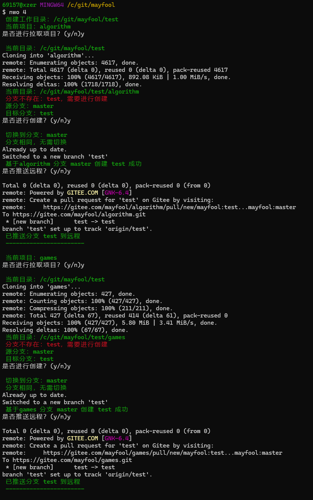

### 3.3 批量创建分支

```bash
# 创建dev环境对应的分支
nb 4 -e dev
```

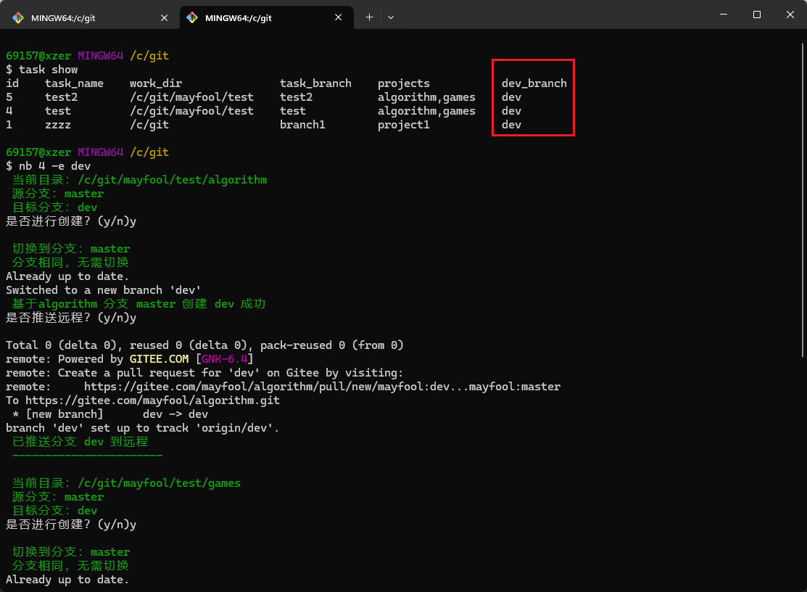

```bash
# 指定创建对应的分支
nb 4 -b 1.0.1
```

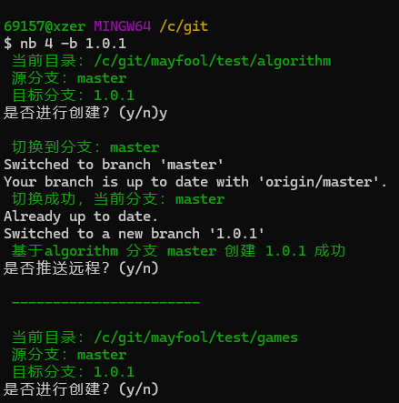

### 3.4 批量切换分支

```bash
# 批量切换任务分支
cby 4 # 等效于 `cb 4 -y`
```

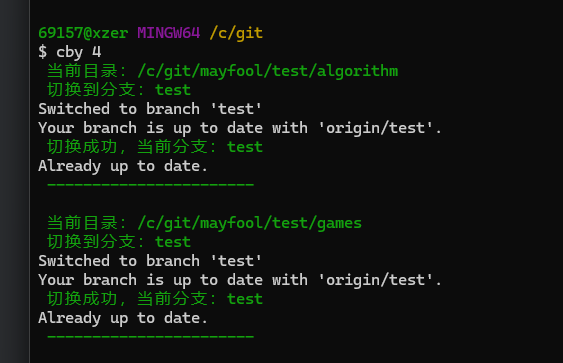

### 3.5 批量合并分支

```bash
# 无冲突自动合并提交
mg 4 -e dev
```

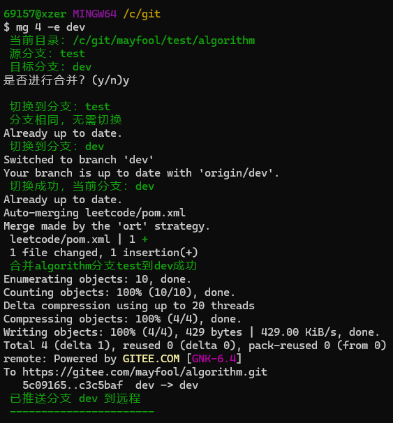
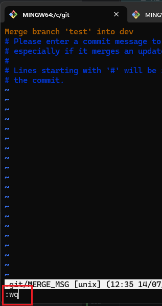

```bash
# 有冲突合并后再提交
mg 4 -e dev
```

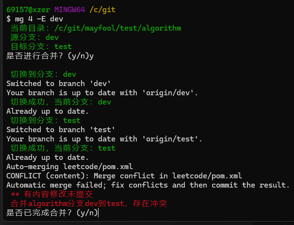

在ide中解决代码冲突后，回到gitbash继续提交

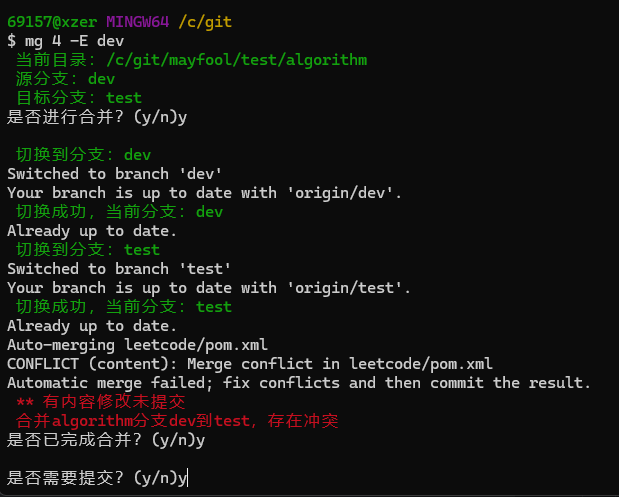
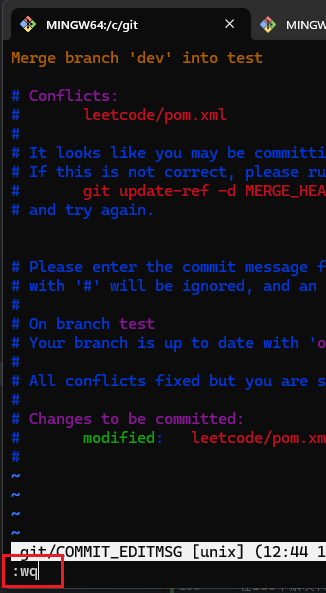
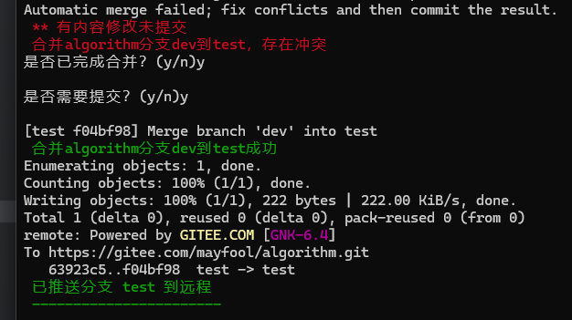

### 3.6 批量删除分支

```bash
db -y 4
```

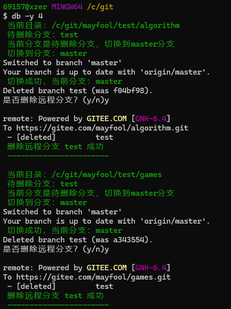

### 3.7 删除任务

```bash
# 删除任务4，逻辑删除，记录会保留
task del 4
```

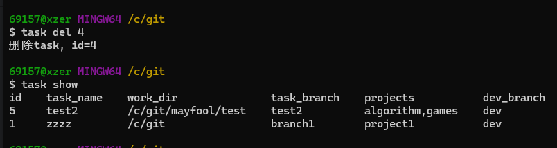

### 3.8 清除已删除任务

```bash
# 清除已删除任务，重置任务id
task clear
```

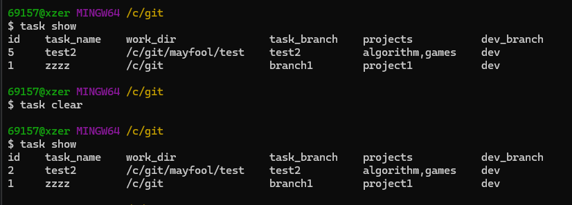

## 4. FAQ

### 4.1 git alias.sh无法修改怎么解决

> 1. 公司内部域账号没有权限，把git安装到个人用户目录，或者非权限控制目录下
> 2. 有权限，但是文本编辑器无法直接保存，复制到桌面，修改后再覆盖回去

## 5. 联系方式

> QQ: 691573424